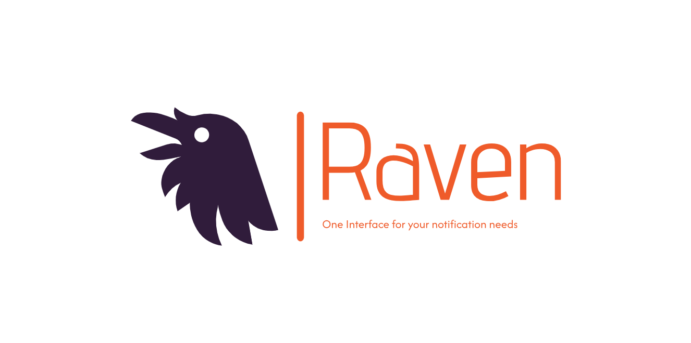

<p align="center">
  <a href="" rel="noopener">
  </a>
</p>

<div align="center">

[](https://github.com/chijioke-ibekwe/raven/actions/workflows/run-tests.yml)
[](https://packagist.org/packages/chijioke-ibekwe/raven)
[](https://packagist.org/packages/chijioke-ibekwe/raven)
[](https://packagist.org/packages/chijioke-ibekwe/raven)
[](https://github.com/chijioke-ibekwe/raven/issues)
[](https://github.com/chijioke-ibekwe/raven/pulls)
[](/LICENSE)

</div>

---

<p align="center"> Multi-channel Laravel notification package
    <br> 
</p>

## 📝 Table of Contents

- [About](#about)
- [Getting Started](#getting_started)
- [Usage](#usage)
- [Built Using](#built_using)
- [Authors](#authors)

## 🧐 About <a name = "about"></a>
Raven is a config-driven, multi-channel notification package for Laravel. Define your notification contexts — channels
and templates — in a config file, and dispatch them with a single line. No notification classes to write.

- **Multi-channel** — Email (SendGrid, Amazon SES), SMS (Vonage, Twilio), and database/in-app notifications through one interface.
- **Channel isolation** — each recipient on each channel is dispatched as an independent queued job, so a failure in one doesn't block the others.
- **Provider-agnostic** — swap providers (e.g. Vonage to Twilio) by changing an env var. No code changes.
- **Dispatch control** — sync, delayed, and after-commit dispatch modes via the Scroll API.
- **Encrypted payloads** — optionally encrypt queued notification payloads at rest.
- **Observability** — `RavenNotificationSent` and `RavenNotificationFailed` events fired after each delivery attempt, per recipient.
- **Artisan scaffolding** — `php artisan raven:make-context` to interactively generate notification contexts and template files.

## 🏁 Getting Started <a name = "getting_started"></a>

### Prerequisites
To use this package, you need the following requirements:

1. PHP >= v8.1
2. Laravel >= v10.0 (v10, v11, v12, v13)
3. Composer

## 🎈 Usage <a name="usage"></a>
1. You can install this package via Composer using the command:
   ```bash
    composer require chijioke-ibekwe/raven
    ```

2. Next, publish the config files:
    ```bash
    php artisan vendor:publish --provider="ChijiokeIbekwe\Raven\RavenServiceProvider" --tag=raven-config
    php artisan vendor:publish --provider="ChijiokeIbekwe\Raven\RavenServiceProvider" --tag=raven-contexts
    ```

3. Two config files will be published to your config directory `./config`:
   - `raven.php` — the main package configuration
   - `notification-contexts.php` — where you define your notification contexts (see step 4)

   The content of `raven.php` is as shown below:
    ```php
   <?php

    return [
    
        'default' => [
            'email' => env('EMAIL_NOTIFICATION_PROVIDER', 'sendgrid'),
            'sms' => env('SMS_NOTIFICATION_PROVIDER', 'vonage')
        ],
    
        'providers' => [
            'sendgrid' => [
                'key' => env('SENDGRID_API_KEY')
            ],
            'ses' => [
                'key' => env('AWS_ACCESS_KEY_ID'),
                'secret' => env('AWS_SECRET_ACCESS_KEY'),
                'region' => env('AWS_DEFAULT_REGION', 'us-east-1')
            ],
            'vonage' => [
                'api_key' => env('VONAGE_API_KEY'),
                'api_secret' => env('VONAGE_API_SECRET')
            ],
            'twilio' => [
                'account_sid' => env('TWILIO_ACCOUNT_SID'),
                'auth_token' => env('TWILIO_AUTH_TOKEN')
            ]
        ],

        'customizations' => [
            'email' => [
                'from' => [
                    'address' => env('MAIL_FROM_ADDRESS', 'hello@example.com'),
                    'name' => env('MAIL_FROM_NAME', 'Example'),
                ]
            ],
            'sms' => [
                'from' => [
                    'name' => env('SMS_FROM_NAME', 'Example'),
                    'phone_number' => env('SMS_FROM_PHONE_NUMBER'),
                ]
            ],
            'queue_name' => env('RAVEN_QUEUE_NAME'),
            'queue_connection' => env('RAVEN_QUEUE_CONNECTION'),
            'templates_directory' => env('TEMPLATES_DIRECTORY', resource_path('templates'))
        ]
    ];
    ```
   - The `default` array allows you to configure your default service providers for your notification channels. Options
     are `sendgrid` and `ses` for email, and `vonage` or `twilio` for SMS.
   - The `providers` array is where you supply the credentials for the service provider you choose. When using `ses`,
     email templates are stored on the filesystem as `.html` files. The `email_subject` field must be provided in the
     notification context, and `email_template_filename` must point to a valid `.html` file in the `email` subdirectory
     of your templates directory.
   - The `customizations` array allows you to customize your email parameters, queue settings, and templates directory.
     - `queue_name` — sets the default queue name for all Raven notifications. The Laravel default queue is used if not provided.
     - `queue_connection` — sets the default queue connection for all Raven notifications. The Laravel default connection is used if not provided.
     - These global queue settings act as fallbacks. Per-channel queue routing can be configured on individual notification contexts (see step 4).
     - The default templates directory is a directory called `templates` in the resources path 
     - The templates directory set, will contain three directories within: `email` (relevant when using the `ses` email provider), `sms`, and `in_app`.
     - The `email` directory will contain the `.html` templates for your emails. 
     - The `sms` directory will contain the `.txt` files with the contents of your sms notifications. 
     - The `in_app` directory will contain `.json` files whose contents will be saved on the data column of the database notifications table. 
     - All placeholders in these templates should be surrounded by double curly braces e.g `{{name}}`.
     - File names of these templates must match the file names in the `email_template_filename`, `sms_template_filename` and `in_app_template_filename` keys in the notification context config entry.

4. You can create notification contexts either interactively via the artisan command, or manually in the config file.

   **Option A — Using the artisan command (recommended)**

   Run the following command and follow the interactive prompts:
   ```bash
   php artisan raven:make-context
   ```
   The command will walk you through:
   - Choosing a context name
   - Adding an optional description
   - Selecting channels (email, sms, database)
   - Configuring template fields based on your selected channels and email provider
   - Optionally enabling payload encryption and per-channel queue routing

   Once confirmed, the context entry is appended to `notification-contexts.php` and any referenced template files are
   created in the appropriate subdirectories of your templates directory.

   **Option B — Manual configuration**

   Open the published `notification-contexts.php` config file and define your notification contexts. Each context is
   keyed by its name and contains the relevant fields for the notification type(s) it handles. Examples for each type
   are shown below:
   - Email Notification Context (when using `sendgrid` as provider)
    ```php
    // config/notification-contexts.php
    return [
        'user-verified' => [
            'description'       => 'Notification to inform a user that they have been verified on the platform',
            'email_template_id' => env('TEMPLATE_USER_VERIFIED', 'd-ad34ghAwe3mQRvb29'),
            'channels'          => ['email'],
            'active'            => true,
        ],
    ];
    ```

   - Email Notification Context (when using `ses` as provider)
    ```php
    // config/notification-contexts.php
    return [
        'user-verified' => [
            'description'             => 'Notification to inform a user that they have been verified on the platform',
            'email_template_filename' => 'user-verified.html',
            'email_subject'           => 'Welcome, {{name}}! Your account has been verified',
            'channels'                => ['email'],
            'active'                  => true,
        ],
    ];
    ```

   - SMS Notification Context
    ```php
    // config/notification-contexts.php
    return [
        'user-verified' => [
            'description'          => 'Notification to inform a user that they have been verified on the platform',
            'sms_template_filename' => 'user-verified.txt',
            'channels'             => ['sms'],
            'active'               => true,
        ],
    ];
    ```
    `user-verified.txt`
    ```text
    "Hello {{name}}. This is to let you know that your account with email {{email}} has been verified"
    ```

   - Database Notification Context
    ```php
    // config/notification-contexts.php
    return [
        'user-verified' => [
            'description'              => 'Notification to inform a user that they have been verified on the platform',
            'in_app_template_filename' => 'user-verified.json',
            'channels'                 => ['database'],
            'active'                   => true,
        ],
    ];
    ```
    `user-verified.json`
    ```json
    {
        "title": "You have been verified",
        "body": "Hello {{name}}. This is to let you know that your account with email {{email}} has been verified"
    }
    ```

   - Email, SMS and Database Notification Context
    ```php
    // config/notification-contexts.php
    return [
        'user-verified' => [
            'description'              => 'Notification to inform a user that they have been verified on the platform',
            'email_template_id'        => env('TEMPLATE_USER_VERIFIED', 'd-ad34ghAwe3mQRvb29'),
            'sms_template_filename'    => 'user-verified.txt',
            'in_app_template_filename' => 'user-verified.json',
            'channels'                 => ['email', 'sms', 'database'],
            'active'                   => true,
        ],
    ];
    ```

   - Context with per-channel queue routing and encrypted payloads
    ```php
    // config/notification-contexts.php
    return [
        'password-reset' => [
            'description'             => 'Password reset OTP notification',
            'email_template_filename' => 'password-reset.html',
            'email_subject'           => 'Reset your password',
            'sms_template_filename'   => 'password-reset.txt',
            'channels'                => ['email', 'sms'],
            'active'                  => true,
            'encrypted'               => true,
            'queue'                   => [
                'email' => ['queue' => 'critical', 'connection' => 'sqs'],
                'sms'   => ['queue' => 'critical'],
            ],
        ],
    ];
    ```
     - `encrypted` — when `true`, queue payloads are encrypted at rest using Laravel's `ShouldBeEncrypted` interface. Defaults to `false`.
     - `queue` — an optional associative array for per-channel queue routing. Each key is a lowercase channel name (`email`, `sms`, `database`) mapping to an array with optional `queue` and `connection` keys. Channels not listed fall back to the global `queue_name`/`queue_connection` in `raven.php`, then to Laravel defaults.

5. To send a notification at any point in your code, build a `Scroll` object, set the relevant
   fields as shown below, and dispatch a `Raven` with the `Scroll`:

   ```php
           $verified_user = User::find(1);
           $document_url = "https://example.com/laravel-cheatsheet.pdf";

           $scroll = Scroll::make()
               ->for('user-verified')
               ->to([$verified_user, 'admin@raven.com'])
               ->cc(['john.doe@raven.com' => 'John Doe', 'jane.doe@raven.com' => 'Jane Doe'])
               ->bcc(['audits@raven.com' => 'Audit Team'])
               ->replyTo('support@raven.com')
               ->with([
                   'id' => $verified_user->id,
                   'name' => $verified_user->name,
                   'email' => $verified_user->email
               ])
               ->attach($document_url);

           Raven::dispatch($scroll);
   ```
   - `for()` is required and must match a notification context name defined in the
     `notification-contexts.php` config file.
   - `to()` is required and takes any single notifiable/email string, or an array of notifiables/email
     strings that should receive the notification. For email notifications, your notifiable model is expected to have an
     `email` field. If the field is named something different on the model e.g `email_address`, you are required to 
     provide the `routeNotificationForMail` method on the model, in a similar manner as below: 
     ```php
             use Illuminate\Notifications\Notifiable;
             use Illuminate\Foundation\Auth\User as Authenticatable;
         
             class User extends Authenticatable
             {
                 use Notifiable;
     
                 public function routeNotificationForMail()
                 {
                     return $this->email_address;
                 }
             }
     ```
     For SMS notifications, the notifiable is required to have a similar method on the notifiable model that matches
     the SMS provider name. For instance, if your SMS notification provider is `vonage`, you should have a method
     called `routeNotificationForVonage` on the notifiable, which returns the phone number field on the model.
     Similarly, if your provider is `twilio`, the method should be called `routeNotificationForTwilio`.
   - `cc()` is exclusively for email notifications and takes an array (or associative array with email/name as
     key/value pairs respectively) of emails you want to CC on the email notification.
   - `bcc()` is exclusively for email notifications and takes an associative array (email as key, name as value)
     of emails you want to BCC on the email notification.
   - `replyTo()` is exclusively for email notifications and takes an email address string to set as the reply-to
     address on the email notification.
   - `with()` takes an associative array of all the variables that exist on the notification
     template with their values, where the key must match the variable name on the template.
   - `attach()` takes a url or an array of urls that point to the publicly accessible resource(s) that
     needs to be attached to the email notification.

### Dispatch Options

   The `Scroll` object supports several methods for controlling dispatch behavior:

   **Channel override** — send only specific channels, ignoring the context's channel list:
   ```php
   $scroll = Scroll::make()
       ->for('user-verified')
       ->to($user)
       ->channels(['email'])  // only send email, even if context defines sms and database too
       ->with(['name' => $user->name]);

   Raven::dispatch($scroll);
   ```

   **Sync dispatch** — run the notification synchronously in the current process, bypassing the queue. Useful for critical notifications like password resets or OTPs:
   ```php
   $scroll = Scroll::make()
       ->for('password-reset')
       ->to($user)
       ->sync()
       ->with(['otp' => $otp]);

   Raven::dispatch($scroll);
   ```

   **Delayed dispatch** — delay notification processing. Pass a single value for all channels, or an associative array for per-channel delays:
   ```php
   // Delay all channels by 60 seconds
   $scroll = Scroll::make()
       ->for('order-confirmed')
       ->to($user)
       ->delay(60)
       ->with(['order_id' => $order->id]);

   // Per-channel delay: email in 30 minutes, SMS immediately
   $scroll = Scroll::make()
       ->for('order-confirmed')
       ->to($user)
       ->delay([
           'email' => now()->addMinutes(30),
           'sms'   => 0,
       ])
       ->with(['order_id' => $order->id]);

   Raven::dispatch($scroll);
   ```

   **After commit** — dispatch to the queue only after the current database transaction commits. This prevents queue workers from processing a notification before the related database changes are visible:
   ```php
   DB::transaction(function () use ($user) {
       $user->update(['verified' => true]);

       $scroll = Scroll::make()
           ->for('user-verified')
           ->to($user)
           ->afterCommit()
           ->with(['name' => $user->name]);

       Raven::dispatch($scroll);
   });
   ```

   You can also use `beforeCommit()` to explicitly dispatch immediately, overriding a queue connection that has `after_commit` set to `true` by default.

   > **Note:** `sync()` takes precedence — when set, `delay()`, `afterCommit()`, and `beforeCommit()` are ignored since the job runs inline without touching the queue.

### Events

   Raven fires events after each per-recipient delivery attempt, allowing you to log outcomes, trigger side effects, or build dashboards.

   | Event | Fired when | Properties |
   |-------|-----------|------------|
   | `RavenNotificationSent` | A channel delivery succeeds | `$scroll`, `$context`, `$channel`, `$recipient` |
   | `RavenNotificationFailed` | A channel delivery throws | `$scroll`, `$context`, `$channel`, `$recipient`, `$exception` |

   Register listeners in your `EventServiceProvider` (or, from Laravel 11+, in your application's `AppServiceProvider`):
   ```php
   use ChijiokeIbekwe\Raven\Events\RavenNotificationSent;
   use ChijiokeIbekwe\Raven\Events\RavenNotificationFailed;

   // In EventServiceProvider::$listen
   protected $listen = [
       RavenNotificationSent::class => [
           \App\Listeners\LogNotificationSuccess::class,
       ],
       RavenNotificationFailed::class => [
           \App\Listeners\LogNotificationFailure::class,
       ],
   ];
   ```

6. To successfully send Database Notifications, it is assumed that the user of this package has already set up a
   notifications table in their project via the command below:

    ```bash
    php artisan notifications:table
    ```
    And subsequently:
    ```bash
    php artisan migrate
    ```
    The data column for database notifications using this package, will capture whatever key-value pairs you have in the json template for that notification. 
    All placeholders surrounded by `{{}}` in the template will be replaced with their values passed in as params of the same name when creating the `Scroll` object.  
    NB:  
    On the notifications table migration file, ensure that the `notifiable` column data type matches the data type for your notifiable primary key.  
    By default, the data type is `morphs`. However, if the  primary key for your notifiable is a `uuid` or `ulid`, ensure you change the type to
    `uuidMorphs` or `ulidMorphs` respectively.

7. The package takes care of the rest of the logic.

### Exceptions
The following exceptions can be thrown by the package for the scenarios outlined below:
1. `RavenContextNotFoundException` `code: 404`
   - Dispatching a Raven with a `Scroll` object that has a `contextName` which does not exist in the `notification-contexts.php` config file.
2. `RavenInvalidDataException` `code: 422`
   - Dispatching a Raven with a `Scroll` object without a `contextName` or `recipient`.
   - Attempting to send an Email Notification using a `NotificationContext` that has no `email_template_id` when your email provider or
     template source is `sendgrid`.
   - Attempting to send an Email Notification using a `NotificationContext` that has an invalid channel i.e a channel
     that isn't one of "EMAIL", "DATABASE", or "SMS".
   - Attempting to send an Email Notification using a `NotificationContext` that has no `email_template_filename` or `email_subject`
     when your email provider is `ses` and template source is `filesystem`.
   - Attempting to send a Database Notification using a `NotificationContext` that has no `in_app_template_filename`.
   - Attempting to send an SMS Notification using a `NotificationContext` that has no `sms_template_filename`.
   - Attempting to send a Database Notification using a `NotificationContext` that has a non-existent template file that matches the
     `in_app_template_filename` in the in-app template directory.
   - Attempting to send an SMS Notification using a `NotificationContext` that has a non-existent template file that matches the
     `sms_template_filename` in the sms template directory.
   - Attempting to send an Email Notification to a notifiable that has no `email` field or a `routeNotificationForMail()`
     method in the model class.
   - Attempting to send an SMS Notification to a notifiable that has no `routeNotificationFor$Provider()` method in the model class.
3. `RavenDeliveryException` `code: 502`
   - A notification channel (SendGrid, Vonage, Twilio, or Amazon SES) fails to deliver a message due to an API error,
     a non-success response status, or an SDK exception. Each recipient is dispatched as a separate queued job, so
     failures are isolated per recipient.
4. `RavenTemplateNotFoundException` `code: 404`
   - A template file referenced by a notification context cannot be found on the filesystem.

## ⛏️ Built Using <a name = "built_using"></a>
- [PHP](https://www.php.net/) - Language
- [Orchestral Testbench](https://github.com/orchestral/testbench) - Library
- [AWS PHP SDK](https://github.com/aws/aws-sdk-php) - Library
- [Sendgrid PHP Library](https://github.com/sendgrid/sendgrid-php) - Library
- [PHP Mailer](https://github.com/PHPMailer/PHPMailer) - Library
- [Vonage](https://github.com/vonage/vonage-php-sdk-core) - Library
- [Twilio](https://github.com/twilio/twilio-php) - Library

## ✍️ Authors <a name = "authors"></a>
- [@chijioke-ibekwe](https://github.com/chijioke-ibekwe) - Initial work
