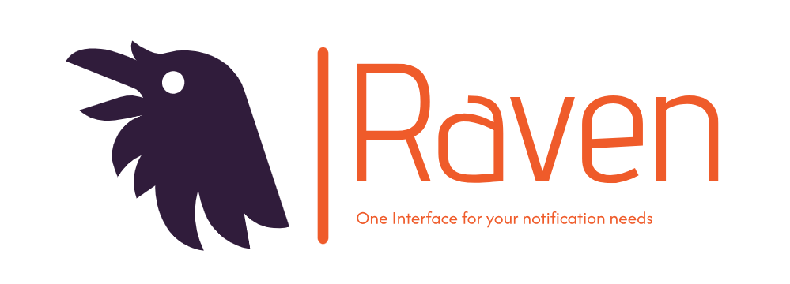

<p align="center">
  <a href="" rel="noopener">
  </a>
</p>

<div align="center">

[]()
[](https://github.com/chijioke-ibekwe/raven/issues)
[](https://github.com/chijioke-ibekwe/raven/pulls)
[](/LICENSE)

</div>

---

<p align="center"> Multi-channel Laravel notification package
    <br> 
</p>

## 📝 Table of Contents

- [About](#about)
- [Getting Started](#getting_started)
- [Usage](#usage)
- [Built Using](#built_using)
- [TODO](#todo)
- [Authors](#authors)

## 🧐 About <a name = "about"></a>
In Laravel, crafting notification classes can often feel repetitive (and WET), especially in projects that rely
heavily on notifications. Also, our projects could sometimes feel tightly coupled to certain notification providers  
in such a way that switching providers would require significant code changes, and moving of resources like templates 
from one platform to the other. These are the exact hassles that Raven could save you from. Raven:  
- Simplifies sending diverse notification types via a single interface.
- Ensures your project is loosely coupled to notification providers, allowing you to switch providers with zero code 
  changes when they no longer suit your needs.  
- Allows you to seamlessly combine the best attributes of your favourite notification providers without any hassles. E.g 
  Sendgrid dynamic template creation tool and Amazon SES servers.
    
Currently, Raven seamlessly handles email notifications through SendGrid and Amazon SES, SMS notifications through Vonage, 
as well as database/in-app notifications. More providers are gradually being integrated.

## 🏁 Getting Started <a name = "getting_started"></a>

### Prerequisites
To use this package, you need the following requirements:

1. PHP >= v8.0
2. Laravel >= v8.0
3. Composer

## 🎈 Usage <a name="usage"></a>
1. You can install this package via Composer using the command:
   ```bash
    composer require chijioke-ibekwe/raven
    ```

2. Next, you will need to publish and run the migration files, and the config file. The following command will allow you
   do all of the above:
    ```bash
    php artisan raven:install
    ```

3. The migrations will be published in your project's migrations directory `./database/migrations` while the config file
   `raven.php`, will be published in your config directory `./config`. The content of the config file is as shown below:
    ```php
   <?php

    return [
    
        'default' => [
            'email' => env('EMAIL_NOTIFICATION_PROVIDER', 'sendgrid'),
            'sms' => env('SMS_NOTIFICATION_PROVIDER', 'vonage')
        ],
    
        'providers' => [
            'sendgrid' => [
                'key' => env('SENDGRID_API_KEY')
            ],
            'ses' => [
                'key' => env('AWS_ACCESS_KEY_ID'),
                'secret' => env('AWS_SECRET_ACCESS_KEY'),
                'region' => env('AWS_DEFAULT_REGION', 'us-east-1'),
                'template_source' => env('AWS_SES_TEMPLATE_SOURCE', 'sendgrid')
            ],
            'vonage' => [
                'api_key' => env('VONAGE_API_KEY'),
                'api_secret' => env('VONAGE_API_SECRET')
            ]
        ],
    
        'customizations' => [
            'mail' => [
                'from' => [
                    'address' => env('MAIL_FROM_ADDRESS', 'hello@example.com'),
                    'name' => env('MAIL_FROM_NAME', 'Example'),
                ]
            ],
            'sms' => [
                'from' => [
                    'name' => env('SMS_FROM_NAME', 'Example'),
                ]
            ],
            'queue_name' => env('RAVEN_QUEUE_NAME')
            'templates_directory' => env('TEMPLATES_DIRECTORY', resource_path('templates'))
        ],
    
        'api' => [
            'prefix' => 'api/v1',
            'middleware' => 'api'
        ]
    
    ];
    ```
   - The `default` array allows you to configure your default service providers for your notification channels. Options
     are `sendgrid` and `ses` for email, and `vonage` for SMS.
   - The `providers` array is where you supply the credentials for the service provider you choose. When using `ses`, you 
     can provide the email template in 2 ways. 
     - First is by hosting your email template on `sendgrid`. If this is your preferred option, the `templates_source` should be 
       set as `sendgrid`. NB: For this to work, you need to also provide your credentials for the `sendgrid` provider. 
     - Second option is by storing your email templates on the file system as .html templates. The `templates_source` in 
       this case should be set as `filesystem` and the directory of the templates should be provided on the `templates_directory` under `customizations`. (This option is not currently supported for emails, but will be in the near future).
   - The `customizations` array allows you to customize your email parameters, optionally your `queue_name` (not 
     queue connection) for queueing your notifications, and your templates directory. 
     NB: 
     - The default queue will be used if a queue name is not provided.
     - The default templates directory is a directory called `templates` in the resources path 
     - The templates directory set, will contain three directories within: `email` (relevant only if your template source is `filesystem` and provider is `ses`), `sms`, and `in_app`.
     - The `email` directory will contain the `.html` templates for your emails. 
     - The `sms` directory will contain the `.txt` files with the contents of your sms notifications. 
     - The `in_app` directory will contain `.json` files whose contents will be saved on the data column of the database notifications table. 
     - All placeholders in these templates should be surrounded by double curly braces e.g `{{name}}`.
     - File names of these templates must match the file names in the `email_template_filename`, `sms_template_filename` and `in_app_template_filename` columns on the notification context record. 
   - The `api` array allows you to customize the provided API routes with prefix and middleware group.

4. After the migrations have been run successfully, you can then proceed to add notification contexts to the database.
   To do this, simply create and run migration files similar to the ones below:
   - Email Notification Context (when using `sendgrid` as provider or template source)
    ```php
    <?php
    
    use Illuminate\Database\Migrations\Migration;
    use Illuminate\Support\Facades\DB;
    
    return new class extends Migration
    {
        /**
         * Run the migrations.
         */
        public function up(): void
        {
            DB::table('notification_contexts')->insert(
                array(
                    'name' => 'user-verified',
                    'email_template_id' => 'd-ad34ghAwe3mQRvb29',
                    'description' => 'Notification to inform a user that they have been verified on the platform',
                    'channels' => json_encode(['EMAIL'])
                )
            );
        }
    
        /**
         * Reverse the migrations.
         */
        public function down(): void
        {
            DB::table('notification_contexts')->where('name', 'user-verified')->delete();
        }
    };
    
    ```

   - Email Notification Context (when using `ses` as provider and `filesystem` as template source)
    ```php
    <?php
    
    use Illuminate\Database\Migrations\Migration;
    use Illuminate\Support\Facades\DB;
    
    return new class extends Migration
    {
        /**
         * Run the migrations.
         */
        public function up(): void
        {
            DB::table('notification_contexts')->insert(
                array(
                    'name' => 'user-verified',
                    'email_template_filename' => 'user-verified.html',
                    'description' => 'Notification to inform a user that they have been verified on the platform',
                    'channels' => json_encode(['EMAIL'])
                )
            );
        }
    
        /**
         * Reverse the migrations.
         */
        public function down(): void
        {
            DB::table('notification_contexts')->where('name', 'user-verified')->delete();
        }
    };
    
    ```

   - SMS Notification Context
    ```php
    <?php
    
    use Illuminate\Database\Migrations\Migration;
    use Illuminate\Support\Facades\DB;
    
    return new class extends Migration
    {
        /**
         * Run the migrations.
         */
        public function up(): void
        {
            DB::table('notification_contexts')->insert(
                array(
                    'name' => 'user-verified',
                    'sms_template_filename' => 'user-verified.txt',
                    'description' => 'Notification to inform a user that they have been verified on the platform',
                    'type' => 'user',
                    'channels' => json_encode(['SMS'])
                )
            );
        }
    
        /**
         * Reverse the migrations.
         */
        public function down(): void
        {
            DB::table('notification_contexts')->where('name', 'user-verified')->delete();
        }
    };
    
    ```
    `user-verified.txt`
    ```text
    "Hello {{name}}. This is to let you know that your account with email {{email}} has been verified"
    ```

   - Database Notification Context
    ```php
    <?php
    
    use Illuminate\Database\Migrations\Migration;
    use Illuminate\Support\Facades\DB;
    
    return new class extends Migration
    {
        /**
         * Run the migrations.
         */
        public function up(): void
        {
            DB::table('notification_contexts')->insert(
                array(
                    'name' => 'user-verified',
                    'description' => 'Notification to inform a user that they have been verified on the platform',
                    'in_app_template_filename' => 'user-verified.json',
                    'type' => 'user',
                    'channels' => json_encode(['DATABASE'])
                )
            );
        }
    
        /**
         * Reverse the migrations.
         */
        public function down(): void
        {
            DB::table('notification_contexts')->where('name', 'user-verified')->delete();
        }
    };
    
    ```
    `user-verified.json`
    ```json
    {
        "title": "You have been verified",
        "body": "Hello {{name}}. This is to let you know that your account with email {{email}} has been verified"
    }
    ```

   - Email, SMS and Database Notification Context
    ```php
    <?php
    
    use Illuminate\Database\Migrations\Migration;
    use Illuminate\Support\Facades\DB;
    
    return new class extends Migration
    {
        /**
         * Run the migrations.
         */
        public function up(): void
        {
            DB::table('notification_contexts')->insert(
                array(
                    'name' => 'user-verified',
                    'email_template_id' => 'd-ad34ghAwe3mQRvb29',
                    'description' => 'Notification to inform a user that they have been verified on the platform',
                    'sms_template_filename' => 'user-verified.txt',
                    'in_app_template_filename' => 'user-verified.json',
                    'type' => 'user',
                    'channels' => json_encode(['EMAIL', 'SMS', 'DATABASE'])
                )
            );
        }
    
        /**
         * Reverse the migrations.
         */
        public function down(): void
        {
            DB::table('notification_contexts')->where('name', 'user-verified')->delete();
        }
    };
    
    ```

6. To send a notification at any point in your code, build a `Scroll` object, set the relevant
   fields as shown below, and dispatch a `Raven` with the `Scroll`:

   ```php
           $verified_user = User::find(1);
           $document_url = "https://example.com/laravel-cheatsheet.pdf";

           $scroll = new Scroll();
           $scroll->setContextName('user-verified');
           $scroll->setRecipients([$verified_user, 'admin@raven.com']);
           $scroll->setCcs(['john.doe@raven.com' => 'John Doe', 'jane.doe@raven.com' => 'Jane Doe']);
           $scroll->setParams([
               'id' => $verified_user->id,
               'name' => $verified_user->name,
               'email' => $verified_user->email
           ]);
           $scroll->setAttachmentUrls($document_url);

           Raven::dispatch($scroll);
   ```
   - The `contextName` property is required and must match the notification context name for that notification 
     on the database.  
   - The `recipients` property is required and takes any single notifiable/email string, or an array of notifiables/email
     strings that should receive the notification. For email notifications, your notifiable model is expected to have an
     `email` field. If the field is named something different on the model e.g `email_address`, you are required to 
     provide the `routeNotificationForMail` method on the model, in a similar manner as below: 
     ```php
             use Illuminate\Notifications\Notifiable;
             use Illuminate\Foundation\Auth\User as Authenticatable;
         
             class User extends Authenticatable
             {
                 use Notifiable;
     
                 public function routeNotificationForMail()
                 {
                     return $this->email_address;
                 }
             }
     ```
     For SMS notifications, the notifiable is required to have a similar method on the notifiable model that matches 
     the SMS provider name. For instance, if your SMS notification provider is `vonage`, you should have a method 
     called `routeNotificationForVonage` on the notifiable, which returns the phone number field on the model.
   - The `ccs` property is exclusively for email notifications and takes an array (or associative array with email/name as 
     key/value pairs respectively) of emails you want to CC on the email notification.     
   - The `params` property is an associative array of all the variables that exist on the notification 
     template with their values, where the key must match the variable name on the template.  
   - Finally, the `attachmentUrls` field takes a url or an array of urls that point to the publicly accessible resource(s) that 
     needs to be attached to the email notification.  

7. To successfully send Database Notifications, it is assumed that the user of this package has already set up a 
   notifications table in their project via the command below:

    ```bash
    php artisan notifications:table
    ```
    And subsequently:
    ```bash
    php artisan migrate
    ```
    The data column for database notifications using this package, will capture whatever key-value pairs you have in the json template for that notification. 
    All placeholders surrounded by `{{}}` in the template will be replaced with their values passed in as params of the same name when creating the `Scroll` object.  
    NB:  
    On the notifications table migration file, ensure that the `notifiable` column data type matches the data type for your notifiable primary key.  
    By default, the data type is `morphs`. However, if the  primary key for your notifiable is a `uuid` or `ulid`, ensure you change the type to
    `uuidMorphs` or `ulidMorphs` respectively.

8. The package takes care of the rest of the logic.

### API
The following API is included in this package for ease of use:
1. `GET /api/v1/notification-contexts`
   - Fetches all notification contexts on the database. The user of this API has to be authenticated.
   - Return a JSON of the format below:
   ```json
    {
        "status": "success",
        "message": "Notification contexts retrieved successfully",
        "data": [
            {
                "id": 1,
                "created_at": "2024-10-18 14:25",
                "updated_at": "2024-10-18 14:25",
                "email_template_id": "d-ad34ghAwe3mQRvb29",
                "email_template_filename": null,
                "name": "user-verified",
                "description": "Notification to inform a user that they have been verified on the platform",
                "sms_template_filename": null,
                "in_app_template_filename": "user-verified.json",
                "type": "user",
                "active": true,
                "channels": [
                    "EMAIL",
                    "DATABASE"
                ]
            }
        ]
    }
   ```
   - When user is not authenticated, it returns the following `401` response:
   ```json
   {
        "status": false,
        "message": "You are not authorized to access this API"
   }
   ```

### Exceptions
The following exceptions can be thrown by the package for the scenarios outlined below:
1. `RavenEntityNotFoundException` `code: 404`
   - Dispatching a Raven with a `Scroll` object that has a `contextName` which does not exist on the database.
2. `RavenInvalidDataException` `code: 422`
   - Dispatching a Raven with a `Scroll` object without a `contextName` or `recipient`.
   - Attempting to send an Email Notification using a `NotificationContext` that has no `email_template_id` when your email provider or 
     template source is `sendgrid`.
   - Attempting to send an Email Notification using a `NotificationContext` that has an invalid channel i.e a channel that 
     that isn't one of "EMAIL", "DATABASE", or "SMS".
   - Attempting to send an Email Notification using a `NotificationContext` that has no `email_template_filename` when your email   
     provider is `ses` and template source is `filesystem`.
   - Attempting to send a Database Notification using a `NotificationContext` that has no `in_app_template_filename`.
   - Attempting to send an SMS Notification using a `NotificationContext` that has no `sms_template_filename`.
   - Attempting to send a Database Notification using a `NotificationContext` that has a non-existent template file that matches the 
     `in_app_template_filename` in the in-app template directory.
   - Attempting to send an SMS Notification using a `NotificationContext` that has a non-existent template file that matches the
     `sms_template_filename` in the sms template directory.
   - Attempting to send an Email Notification to a notifiable that has no `email` field or a `routeNotificationForMail()` 
     method in the model class.
   - Attempting to send an SMS Notification to a notifiable that has no `routeNotificationFor$Provider()` method in the model class.

## ⛏️ Built Using <a name = "built_using"></a>
- [PHP](https://www.php.net/) - Language
- [Orchestral Testbench](https://github.com/orchestral/testbench) - Library
- [AWS PHP SDK](https://github.com/aws/aws-sdk-php) - Library
- [Sendgrid PHP Library](https://github.com/sendgrid/sendgrid-php) - Library
- [PHP Mailer](https://github.com/PHPMailer/PHPMailer) - Library
- [Vonage](https://github.com/vonage/vonage-php-sdk-core) - Library

## ✍️ Authors <a name = "authors"></a>
- [@chijioke-ibekwe](https://github.com/chijioke-ibekwe) - Initial work
